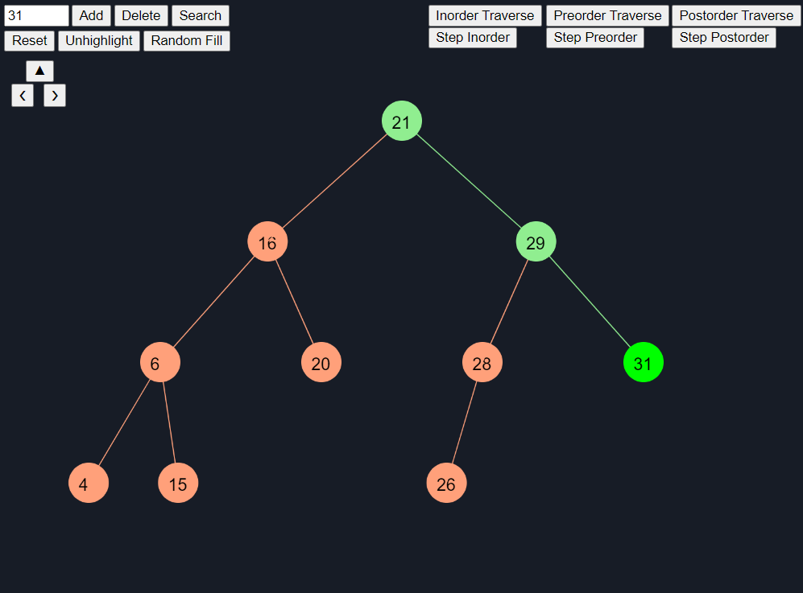

# Binary Search Tree Implemented Using The Functional Programming Paradigm

## Overview

This repository contains two versions implementations, both following the functional programming paradigm. The first was implemnted using TypeScript and has a complete set of tests generated using the Jest framework.

The second was imlemented using JavaScript and the p5.js library, allowing an interactive visualization of the tree availble [here](https://editor.p5js.org/a.ferrariiaquinta/full/dCnjQUtwU). This version allows the user to insert, delete, search, traverse, traverse step by step and navigate the tree. During the execution of each action, the nodes involved are highlighted so that it is possible to follow the process step by step.

The image below shows the visual representation of an insert action in the p5.js implementation.

## Technologies

- Functional Programming
- TypeScript
- Jest
- JavaScript
- p5.js
